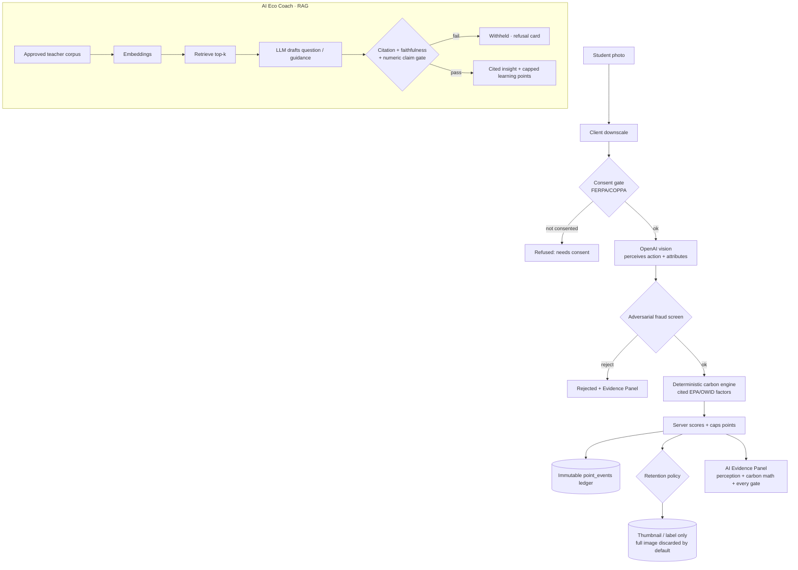

# EcoRise — AI-Powered Environmental Learning + Action

EcoRise is a school and community platform where students learn environmental science, log real-world eco actions, and compete on leaderboards without letting AI invent impact or award unverified points.

**USAII Global AI Hackathon 2026 Direction B:** EcoRise is framed as "My School's Hidden Footprint." The AI Eco Coach is now the default product surface: it reads local school activity, retrieves approved environmental evidence, identifies action gaps, and converts those insights into verified student actions.

**The pitch:** Duolingo-style environmental learning meets verified action tracking. The AI teaches and explains; deterministic code validates sources, carbon math, fraud checks, and points.


---

## Why Judges Should Care

Most sustainability apps either teach passively or gamify actions without proof. EcoRise connects the full loop:

1. A student learns from a cited, teacher-approved source.
2. The AI Eco Coach studies the school's local action pattern and identifies the weakest footprint category.
3. The coach asks a grounded question, explains the answer, and recommends a practical next action.
4. Small learning points are capped so questions cannot be farmed.
5. A photo submission is checked by AI vision, anti-fraud gates, carbon math, and server-side scoring.
6. The leaderboard rewards verified environmental behavior, not vibes.

That makes the product easy to demo and technically defensible: every important claim has a source, a deterministic check, or an eval.

> **Sticky hook:** _The AI never awards a point or invents a kilogram. It perceives; a deterministic, cited engine decides._

## What's new in v2 (Direction B)

- **School Hidden-Footprint digest** — estimates a school's institutional CO₂e by category from cited EPA/OWID factors, each with a confidence band, and points students at the biggest hidden emitter.
- **Privacy / FERPA-COPPA engine** — consent gate before any minor's photo is processed, image-retention minimization, teacher review, account export/delete, audit log. See [`docs/PRIVACY.md`](docs/PRIVACY.md).
- **In-app AI report card** — real eval-harness output (citation validity, faithfulness, refusal precision, hallucination, injection resistance, retrieval Recall@k/MRR), not hardcoded.
- **Scale honesty** — measured load test + **sqlite-vec KNN index now active** (see [`docs/SCALE.md`](docs/SCALE.md) for the documented migration path to pgvector).
- **Run the demo:** [`DEMO_SCRIPT.md`](DEMO_SCRIPT.md) · **Deploy + record:** [`DEPLOY.md`](DEPLOY.md)

## Architecture — the perception / calculation split



The LLM only appears in the _perceive_ and _draft_ boxes. Every box that touches a number, a point, or a published post is deterministic code with a citation or a gate.

## How EcoRise compares

|               | Typical eco app           | Generic "AI" hackathon app | **EcoRise**                                                                              |
| ------------- | ------------------------- | -------------------------- | ---------------------------------------------------------------------------------------- |
| Impact number | self-reported / hardcoded | LLM guesses it             | deterministic carbon engine, cited EPA/OWID factors + uncertainty band                   |
| Points        | client-trusted            | LLM awards them            | server-computed, capped, immutable ledger; LLM cannot mint                               |
| AI grounding  | none                      | ungrounded generation      | retrieval + citation + faithfulness + numeric-claim gates; refuses if unsupported        |
| Minor privacy | ignored                   | ignored                    | consent gate before upload, image minimization, teacher review, export/delete, audit log |
| Evaluation    | "it works"                | demo only                  | measured: accuracy/FP/FN, Recall@k/MRR, refusal precision, hallucination rate (in-app)   |
| Scale story   | hand-waved                | hand-waved                 | measured load test + documented migration path                                           |

## Core Features

| Feature                       | Description                                                                                                                                                                                                                                                                                                |
| ----------------------------- | ---------------------------------------------------------------------------------------------------------------------------------------------------------------------------------------------------------------------------------------------------------------------------------------------------------- |
| **AI Eco Coach**              | Main app experience. Retrieval-augmented coach that uses approved environmental sources plus local board activity to identify hidden footprint gaps, generate cited questions, explain answers, and recommend practical next actions.                                                                      |
| **AI Evidence Panel**         | After **every** submission: which model decided, its confidence, the **grounded** CO₂ math (formula + cited source + uncertainty range), the full point breakdown, the deterministic tool pipeline that ran, and every anti-fraud gate cleared (or why it was rejected) — the AI's reasoning, made visible |
| **AI Action Analysis**        | Upload a photo → OpenAI vision **perceives** the action + measurable attributes; it never invents the impact                                                                                                                                                                                               |
| **Grounded Carbon Engine**    | Deterministic kg CO₂e from **published emission factors** (EPA GHG Hub, EPA WARM, OWID/Poore-Nemecek) with formula + uncertainty range — the LLM cannot fabricate the number ([`utils/carbonEngine.js`](backend/utils/carbonEngine.js))                                                                    |
| **Measured Eval Gate**        | The eco-action classifier is measured, not asserted: accuracy / FP / FN / adversarial-rejection / calibration ([`test/eco_eval/`](backend/test/eco_eval/), `npm run test:eval`); coach retrieval eval at `npm run test:coach-eval`                                                                         |
| **Adversarial Fraud Screen**  | A second vision pass flags photo-of-screen / stock / AI-generated images; high suspicion rejects, low suspicion halves points ([`utils/integrityGates.js`](backend/utils/integrityGates.js))                                                                                                               |
| **Points Rubric Engine**      | Comprehensive **server-side** scoring across transport, waste, energy, food, nature, and learning; the LLM cannot award points                                                                                                                                                                             |
| **Social Feed**               | Instagram-style cards with likes, comments, @mentions, reporting                                                                                                                                                                                                                                           |
| **Personalized Daily Quests** | 5 quests/day generated from your **real last-30-day behavior** (targets neglected categories), 2× multiplier on completion                                                                                                                                                                                 |
| **Leaderboard**               | Animated podium (3 styles), real-time ranking, reset timers                                                                                                                                                                                                                                                |
| **Trash Spotter**             | Report litter, AI rates severity 0-10, earn bonus points                                                                                                                                                                                                                                                   |
| **Organizer Dashboard**       | Create/manage leaderboards, moderation queue, invite links                                                                                                                                                                                                                                                 |
| **Badges & Streaks**          | Automated badge awards, streak tracking, bonus multipliers                                                                                                                                                                                                                                                 |

---

## Tech Stack

- **Frontend:** React 19 + Vite · Vitest + Testing Library (11 UI tests)
- **Backend:** Node.js + Express · Node built-in test runner (91 backend tests)
- **Database:** SQLite (via better-sqlite3) + **sqlite-vec** for vector KNN retrieval
- **Auth:** JWT (httpOnly cookies) + bcrypt
- **AI:** OpenAI vision (`ECO_MODEL`, default `gpt-4o-mini`) for eco analysis + a custom CNN (ONNX, val_acc 0.936) for offline trash detection. Without an `OPENAI_API_KEY` the server **rejects rather than fabricates** points; set `MOCK_ECO_ALWAYS_PASS=true` for a clearly-flagged demo.
- **Coach AI:** Retrieval-augmented generation over approved source chunks with citation validation, faithfulness + numeric-claim gates, daily/weekly point caps, sqlite-vec KNN index, and seeded demo corpus.
- **Design:** Botanical Ledger — white paper surfaces, moss-green hierarchy, source-chip texture, and sliding screen transitions.

---

## Quick Start

### 1. Clone & Install

```bash
# Install all dependencies
npm run install:all
```

### 2. Configure Environment

```bash
# Copy the template
cp .env.example .env

# Edit .env and add your OpenAI API key (optional — mock mode works without it)
```

### 3. Run Locally

```bash
# Start both frontend + backend
npm run dev

# Optional: seed the AI Eco Coach demo corpus
cd backend && COACH_ENABLED=true npm run seed:coach

# OR — one-command judge demo: seed a populated board + login, then run
npm run demo
#   login: demo@ecorise.app / demo1234   (board "Greenfield High", invite DEMOECO)
```

- **Frontend:** http://localhost:5173
- **Backend API:** http://localhost:3001
- **Health check:** http://localhost:3001/api/health

### Or run separately:

```bash
# Terminal 1: Backend
cd backend && node server.js

# Terminal 2: Frontend
cd frontend && npm run dev
```

---

## 📁 Architecture

```
ecorise/
├── frontend/              React + Vite app
│   ├── src/
│   │   ├── components/    Reusable UI components
│   │   │   ├── AIEvidence.jsx    Evidence panel (carbon math, gates, breakdown)
│   │   │   ├── PrivacyCenter.jsx Consent, retention, export, delete, model card
│   │   │   ├── ResearchLibrary.jsx Research corpus browser
│   │   │   ├── SchoolFootprint.jsx Hidden-footprint digest + baseline wizard
│   │   │   ├── Podium.jsx        Animated leaderboard podium
│   │   │   └── ...               Avatar, BottomNav, Icon, Shared, UI
│   │   ├── pages/         Screen-level components
│   │   │   ├── Home.jsx          Eco feed + action logging
│   │   │   ├── Coach.jsx         AI Eco Coach (RAG, footprint, report card)
│   │   │   ├── Pages.jsx         Leaderboard, profile, trash spotter, badges
│   │   │   ├── Quests.jsx        Daily quest tracker
│   │   │   ├── Research.jsx      Research library page
│   │   │   ├── Modals.jsx        All modal dialogs
│   │   │   └── Onboarding.jsx    Signup/login flows
│   │   ├── __tests__/     Vitest component tests (11 tests)
│   │   ├── styles/        Design tokens + global CSS + component styles
│   │   ├── hooks/         Custom React hooks
│   │   ├── utils/         API client
│   │   └── App.jsx        Root component with routing + state management
│   └── index.html
│
├── backend/               Express API server
│   ├── routes/            REST endpoints
│   │   ├── auth.js        Signup, login, logout, me
│   │   ├── coach.js       AI Eco Coach: footprint, questions, report card
│   │   ├── leaderboard.js CRUD, join, ranking, season resets
│   │   ├── posts.js       Feed, likes, comments, reports
│   │   ├── privacy.js     Consent, retention, review, export/delete, audit
│   │   ├── quests.js      Daily quest generation + progress
│   │   ├── trashspotter.js AI severity analysis (OpenAI + ONNX CNN)
│   │   └── users.js       Profiles, badges, notifications
│   ├── middleware/        auth.js · csrf.js · rateLimit.js · upload.js
│   ├── model/             trash_detector.onnx (val_acc 0.936) + metadata
│   ├── utils/
│   │   ├── aiClient.js        OpenAI API wrapper (vision, text, embeddings)
│   │   ├── carbonEngine.js    Deterministic CO₂e from cited EPA/OWID factors
│   │   ├── pointsEngine.js    Orchestration: vision → fraud → carbon → rubric
│   │   ├── rubric.js          Server-side points calculation engine
│   │   ├── coachRetrieval.js  sqlite-vec KNN retrieval over approved corpus
│   │   ├── coachFaithfulness.js Citation + numeric-claim faithfulness gate
│   │   ├── coachEmbed.js      Embedding utilities
│   │   ├── coachChunk.js      Corpus chunking helpers
│   │   ├── coachScoring.js    Coach point caps + scoring rules
│   │   ├── footprintModel.js  School hidden-footprint estimator (EPA/OWID)
│   │   ├── privacy.js         Consent gate, retention policy, FERPA/COPPA engine
│   │   ├── evalMetrics.js     Recall@k, MRR, calibration, precision/recall
│   │   ├── integrityGates.js  Adversarial fraud screen
│   │   ├── imageHash.js       SHA-256 dedup + perceptual hash
│   │   ├── localTrashModel.js ONNX CNN inference for offline trash detection
│   │   ├── analysisCache.js   Per-request analysis caching
│   │   ├── jsonExtract.js     Robust JSON extraction from LLM output
│   │   ├── seasons.js         Leaderboard season reset scheduler
│   │   └── validate.js        Zod validation schemas
│   ├── scripts/           seedDemo.js · seedCoachCorpus.js · loadSmoke.js
│   ├── test/              91 tests (api · coach · privacy · carbon · eval)
│   ├── db.js              SQLite schema + initialization (sqlite-vec extension)
│   └── server.js          Express entry point
│
├── docs/                  PRIVACY.md · SCALE.md · AI_ECO_COACH_PLAN.md
├── datasets/              ONNX model training scripts + metadata
├── .env                   Local secrets (never commit)
├── .env.example           Template with required keys
└── package.json           Root scripts
```

---

## 📡 API Endpoints

### Auth

| Method | Endpoint           | Description                            |
| ------ | ------------------ | -------------------------------------- |
| POST   | `/api/auth/signup` | Create account (email, password, name) |
| POST   | `/api/auth/login`  | Login (email, password)                |
| POST   | `/api/auth/logout` | Clear session                          |
| GET    | `/api/auth/me`     | Get current user                       |

### Leaderboards

| Method | Endpoint                     | Description                               |
| ------ | ---------------------------- | ----------------------------------------- |
| POST   | `/api/leaderboards`          | Create leaderboard                        |
| GET    | `/api/leaderboards`          | List user's leaderboards                  |
| GET    | `/api/leaderboards/:id`      | Get leaderboard with ranked members       |
| PUT    | `/api/leaderboards/:id`      | Update settings (organizer)               |
| POST   | `/api/leaderboards/join`     | Join via invite code (no board id needed) |
| POST   | `/api/leaderboards/:id/join` | Join via invite code (legacy form)        |

### Posts (Feed)

| Method | Endpoint                 | Description                           |
| ------ | ------------------------ | ------------------------------------- |
| POST   | `/api/posts`             | Create post (image → AI → points)     |
| GET    | `/api/posts`             | Get feed (optional `?leaderboardId=`) |
| POST   | `/api/posts/:id/like`    | Toggle like                           |
| POST   | `/api/posts/:id/comment` | Add comment                           |
| POST   | `/api/posts/:id/report`  | Report post                           |
| DELETE | `/api/posts/:id`         | Remove post (organizer)               |

### Quests

| Method | Endpoint                   | Description                         |
| ------ | -------------------------- | ----------------------------------- |
| GET    | `/api/quests`              | Get today's quests (auto-generates) |
| POST   | `/api/quests/:id/progress` | Update quest progress               |

### Trash Spotter

| Method | Endpoint     | Description                                 |
| ------ | ------------ | ------------------------------------------- |
| POST   | `/api/trash` | Report trash (image → AI severity → points) |
| GET    | `/api/trash` | Get reports                                 |

### Users

| Method | Endpoint                       | Description               |
| ------ | ------------------------------ | ------------------------- |
| GET    | `/api/users/:id`               | Get user profile + badges |
| PUT    | `/api/users/:id`               | Update profile            |
| GET    | `/api/users/:id/notifications` | Get notifications         |

### Coach (AI Eco Coach)

| Method | Endpoint                 | Description                               |
| ------ | ------------------------ | ----------------------------------------- |
| GET    | `/api/coach/footprint`   | School hidden-footprint digest            |
| GET    | `/api/coach/question`    | Retrieve a cited question + guidance      |
| GET    | `/api/coach/eval-report` | In-app AI report card (live eval metrics) |
| GET    | `/api/coach/research`    | Browse the approved research corpus       |

### Privacy (FERPA/COPPA)

| Method | Endpoint                                                 | Description                                                         |
| ------ | -------------------------------------------------------- | ------------------------------------------------------------------- |
| GET    | `/api/privacy/policy`                                    | Public model/data card                                              |
| GET    | `/api/privacy/consent`                                   | My consent state on a board                                         |
| POST   | `/api/privacy/consent`                                   | Record/attest/grant/revoke consent (accepts signed document upload) |
| POST   | `/api/privacy/boards/:id/privacy`                        | Set consent mode, retention, review, display mode                   |
| GET    | `/api/privacy/boards/:id/review-queue`                   | Pending posts (organizer)                                           |
| POST   | `/api/privacy/posts/:id/review`                          | Approve / reject a post (reverses points)                           |
| GET    | `/api/privacy/audit`                                     | Board audit trail (organizer)                                       |
| GET    | `/api/privacy/boards/:id/consent-vault`                  | List members + consent status + document presence (organizer)       |
| GET    | `/api/privacy/boards/:id/consent-vault/:userId/document` | Download a stored signed consent slip (organizer / self)            |
| GET    | `/api/privacy/export`                                    | Download all my data                                                |
| POST   | `/api/privacy/account/delete`                            | Erase my account                                                    |

---

## 🎨 Design System

EcoRise uses a polished white/green system designed to feel like a field notebook crossed with a serious education product.

| Token        | Value          | Usage                                           |
| ------------ | -------------- | ----------------------------------------------- |
| Paper        | `#F7FAF5`      | App background                                  |
| White        | `#FFFFFF`      | Cards and sheets                                |
| Moss green   | `#2E7D4F`      | Primary actions, active navigation, citations   |
| Deep green   | `#1E5B39`      | Headings and high-contrast ink                  |
| Seed gold    | `#C6A35A`      | Prizes, podium accents, restrained highlights   |
| Clay         | `#B66F4D`      | Warnings, rejection states, destructive actions |
| Display font | Fraunces       | Editorial headings                              |
| Body font    | Hanken Grotesk | Dense UI text and labels                        |

---

## 📝 Points Rubric

| Category           | Max    | Example Actions                                                  |
| ------------------ | ------ | ---------------------------------------------------------------- |
| Transportation     | 40 pts | Walking (15 + 1/mi), Biking (15 + 0.8/mi), Transit (10 + 0.5/mi) |
| Waste Reduction    | 30 pts | Recycling (10-20), Composting (15), Zero-waste shopping (20)     |
| Energy             | 25 pts | Line drying (12), Natural light (8), Cold wash (8)               |
| Food & Consumption | 30 pts | Plant-based meal (15), Growing food (20), Buying secondhand (15) |
| Nature & Community | 20 pts | Planting trees (20), Cleanup event (20), Educating others (15)   |

**Bonus multipliers:** First action of day (1.1×) · 7-day streak (1.25×) · Quest completion (2×) · Tagged friends (+5 each, max 3)

---

## 🔒 Security

- All secrets in `.env` (never committed)
- Passwords hashed with bcrypt (12 rounds)
- JWT tokens in httpOnly cookies (7-day expiry)
- AI endpoint rate limited: a configurable per-user daily cap (`middleware/rateLimit.js`) + a global 300 req / 15 min limit; OpenAI calls have a 30s timeout + retry budget
- Image uploads validated (type + size; server JSON limit 9 MB; the client downscales before upload, and the server minimizes what it retains — see `docs/PRIVACY.md`)
- User inputs validated server-side (zod schemas) + parameterized SQL (no string-built queries)
- Reported posts are flagged for organizer moderation; only the post owner or leaderboard organizer can hide a post
